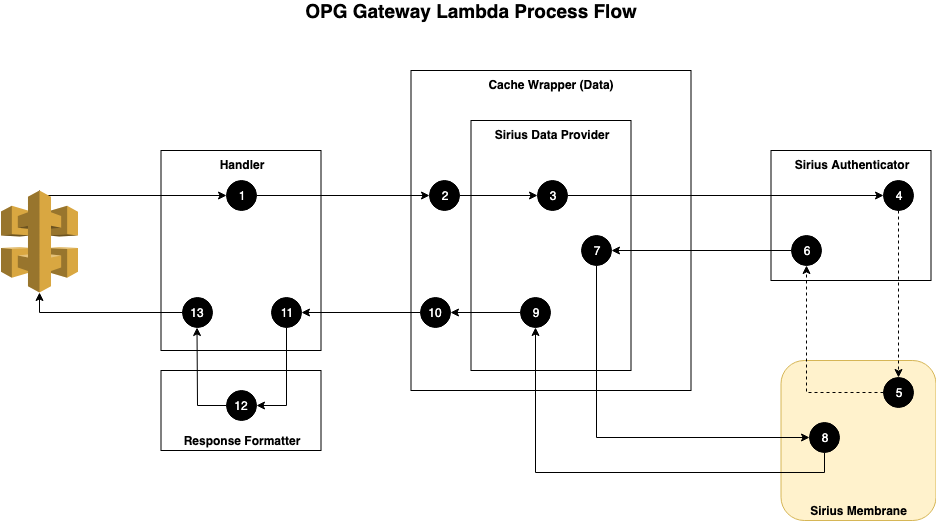

# Lambda Flow

### Step 1
* We received the request from AWS API Gateway.
* The details of the request are in the ‘events’ dictionary.
* We sense check the request.
* Based on config from environment variables we:
    * Create a data provider. In the diagram’s case, the Sirius Data Provider.
    * We decide if we want the data provider wrapped in the Cache Wrapper. Typically we’d only want this on GET requests; not POST, PUT, etc. The cache wrapper works on the exact same interface as the data provider, making it transparent.
* We determine what kind of lookup we’re about to perform using the details in the ‘event’, then call the relevant method on the cache wrapper/data provider.

### Step 2
* Looks up the request in the cache; and simultaneously
* Passed the request on to the Sirius data Provider. 

### Step 3
* We prepare a request object with the data lookup details.
* We pass the request object to the Sirius Authenticator to be decorated with a Membrane Authentication header.

### Step 4
* We request an Authentication token from Sirius Membrane.
* If we have a cached token, we go straight to step 6.

### Step 5
* Sirius’ Membrane returns an authentication token.

### Step 6
* We decorate the lookup request object’s headers with the authentication token.

### Step 7
* We send the lookup request to Sirius.

### Step 8
* Sirius performs the lookup and returns a response.

### Step 9
* If we get a 200, we encode the response into a Response object.
* If we get a 401, and we’d used a cached authentication, we repeat from step 3, forcing the Sirius Authenticator to get a fresh token.
* If we get any other response (including a 401 having used a fresh token) we raise an exception.

### Step 10
* If we get a Response object, we we ensure the response is cached. Either we update the existing entry, or add it in as a new one.
* If we see an exception has been raised, and we have a cached response for the request, we catch the exception and return the cached response.
* If we see an exception has been raised, and do not have a cached response for the request, we don’t catch the exception.

### Step 11
* If a Response object is returned (cached or not), we pass it to the Response Formatter.
* If an exception is seen, we jump to 13.

### Step 12
* The formatter looks at both the response and, which service that made the request (Online tool, Use an LPA, etc.) for the data. Based on those two factors it amends the response to a format the requesting service is expecting. This may include:
    * Amending the states code. e.g. 200 with an empty LpaCollection to a 404.
    * Filtering out unwanted data.  e.g. The LPA Online Tool does not need all the data Sirius returns.

### Step 13
* If a Response object is passed, we added Age and Date HTTP headers, and returned the payload as per API Gateway’s expectations.
* If an exception is caught, we returns an appropriate error response as per API Gateway’s expectations.
